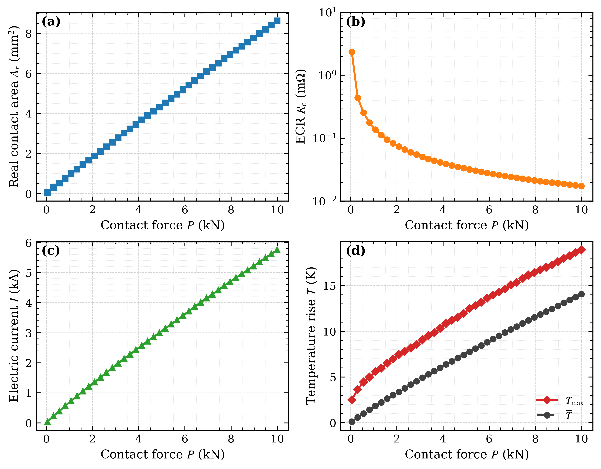
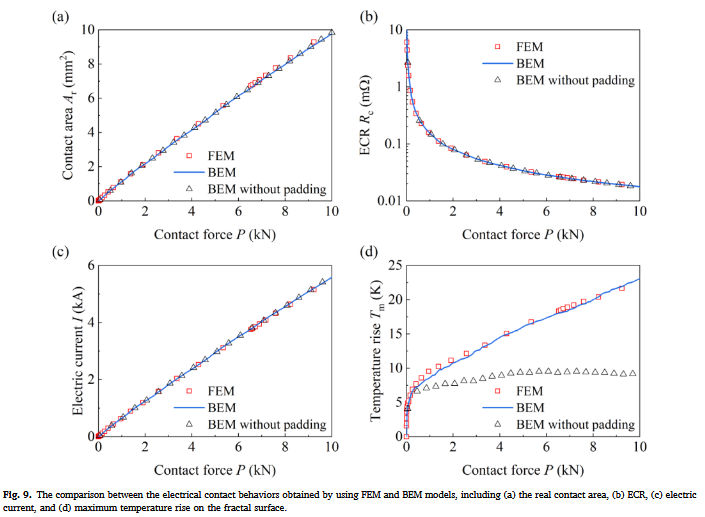

# rough-contact-etm

[](https://github.com/chanblog/rough_contact_etm/actions/workflows/tests.yml)

`rough-contact-etm` is a research-oriented Python workflow for thermo-electro-mechanical (E-T-M) simulations of rough surface contact. It couples a mechanical rough-contact solve from [Tamaas](https://gitlab.com/tamaas/tamaas) with FFT-based electrical and thermal Green's-function post-processing.

The current implementation targets a rigid rough surface pressed against an elastic conducting body. For each load step, the code computes the real contact area, an interfacial electrical current-density field, Joule heat generation, a surface temperature field, and the thermally induced normal displacement that feeds back into the contact geometry.

This repository is intended as reproducible research code rather than a polished general-purpose commercial solver.

Here is a simple comparison of calculation results，





[Click here for source of literature results](https://www.sciencedirect.com/science/article/abs/pii/S0017931024003235)

## Main features

- Random-phase rough surface generation using a power-law roughness spectrum through Tamaas.
- Normal mechanical contact solve using the Polonsky--Keer--Rey algorithm exposed by Tamaas.
- Contact-mask-based electrical solve with an interfacial film conductance model.
- FFT evaluation of the finite-layer electrical Green's function.
- FFT evaluation of the thermal Green's functions for surface temperature and thermal normal displacement.
- Fixed-point E-T-M coupling with adaptive relaxation or Anderson acceleration.
- HDF5 output of pressure, temperature, heat flux, voltage, current density, thermal displacement, and scalar diagnostics.
- Post-processing scripts for load-dependent curves and representative 2D field maps.

## Model assumptions and scope

The implementation deliberately uses a compact physical model. The main assumptions are:

1. **Rigid-on-elastic equivalent contact.** The current example uses a rigid rough surface contacting an elastic solid. The equivalent surface is the rigid roughness after mean removal.
2. **Periodic rough surface.** The mechanical and FFT-based field calculations are formulated on a periodic rectangular grid.
3. **Normal contact only.** Tangential tractions, sliding, frictional heating, adhesion, plasticity, and wear are not included in the default workflow.
4. **Contact-mask electrical conduction.** Electrical current flows only through grid nodes with positive mechanical contact pressure.
5. **Thin-film interfacial conductance.** The default interfacial conductance uses a film-plus-constriction specific resistance, `k_E,j = 1 / (rho_film * l_film + rho_elastic * pi * r_j / 2)`, where `r_j = sqrt(A_j / pi)` is the equivalent radius of each connected contact spot. Set `include_constriction_resistance = False` to recover the thin-film-only model `k_E = 1 / (rho_film * l_film)`. The current version does not include a fully resolved oxide/lubricant breakdown model.
6. **Finite-layer electrical and thermal kernels.** The electrical potential and thermal response are evaluated with finite-height Green's-function kernels using the layer height `h0`.
7. **Quasi-static coupling.** The E-T-M coupling is a fixed-point iteration at each load step. Transient heat diffusion, inertia, and time-dependent surface evolution are not included.
8. **Joule heat partitioning.** A constant heat partition coefficient `heat_partition` assigns a specified fraction of interfacial Joule heat to the modeled body.
9. **Small-deformation thermal feedback.** Thermal displacement modifies the effective surface geometry as `s_effective = s_geom - u_thermal`.

These assumptions should be reviewed before using the code for quantitative engineering predictions.

## Computational workflow

For each load step, the code executes the following loop:

1. Generate or load the equivalent rough surface.
2. Initialize the thermal normal displacement field.
3. Solve the mechanical contact problem for the current effective surface.
4. Extract the positive-pressure contact mask.
5. Solve the electrical fixed-point problem on the contact mask.
6. Convert local electrical power into a surface heat-flux field.
7. Solve the thermal Green's-function problem for temperature and thermal displacement.
8. Update the effective surface and repeat until the coupled residual/update reaches the specified tolerance.
9. Save fields and scalar diagnostics to HDF5.
10. Use the post-processing module to generate summary curves and field plots.

## Repository layout

```text
rough-contact-etm/
├── src/rough_contact_etm/
│   ├── config.py              # default physical and numerical parameters
│   ├── surface.py             # rough surface generation
│   ├── mechanical.py          # Tamaas mechanical contact wrapper
│   ├── electrical.py          # electrical fixed-point solve
│   ├── thermal.py             # thermal Green's-function solve
│   ├── coupling.py            # E-T-M fixed-point algorithms
│   ├── run_simulation.py      # load-sweep driver
│   └── postprocessing.py      # HDF5 post-processing and plotting
├── examples/
│   └── minimal_run.py         # lightweight local smoke test
├── tests/
│   └── test_electrical_thermal.py
├── docs/
│   ├── model.md
│   └── references.bib
├── main01.py                  # backward-compatible simulation launcher
└── post_processing.py         # backward-compatible post-processing launcher
```

## Installation

Create a Python environment with NumPy, Matplotlib, h5py, and pytest:

```bash
conda env create -f environment.yml
conda activate rough-contact-etm
pip install -e .
```

Install Tamaas separately according to the official Tamaas documentation. The full mechanical simulation requires Tamaas. The lightweight electrical/thermal unit tests do not require Tamaas.

## Quick start

Run the lightweight smoke-test example:

```bash
python examples/minimal_run.py
```

Run the default load sweep:

```bash
python main01.py
```

or, after editable installation:

```bash
python -m rough_contact_etm.run_simulation
```

Run post-processing after the simulation has generated HDF5 files:

```bash
python post_processing.py
```

or:

```bash
python -m rough_contact_etm.postprocessing
```

Run unit tests:

```bash
pytest
```

## Key configuration parameters

The default parameters are defined in `src/rough_contact_etm/config.py`. Common parameters to adjust are:

- `n_x`, `n_y`: grid resolution.
- `F_min`, `F_max`, `N_LOAD_STEPS`: load sweep definition.
- `h_rms_rigid`, `hurst`, `seed_rigid`: rough surface statistics.
- `rho_film`, `l_film`: effective film electrical properties.
- `Delta_V_total`: applied voltage drop.
- `coupling_tolerance`, `coupling_max_iters`, `coupling_relaxation`: coupled fixed-point controls.
- `electrical_tolerance`, `electrical_max_iter`, `electrical_relaxation`: electrical fixed-point controls.

For quick tests, prefer editing `examples/minimal_run.py` rather than changing the default configuration.

## Outputs

The simulation writes field data and scalar diagnostics to the configured output directories:

- `rigid_on_elastic_contact_results/`: scalar HDF5 files, convergence plots, generated surfaces.
- `hdf5/rigid_on_elastic_contact_results/`: field-data HDF5 files written by Tamaas dumpers.
- `rigid_on_elastic_contact_results/post_processing_plots/`: post-processed summary plots.

Stored fields include:

- `traction`
- `temperature`
- `heat_flux`
- `voltage`
- `current_density`
- `thermal_displacement`
- `geom_surface`

Stored scalar attributes include:

- real contact area fraction
- absolute real contact area
- contact cluster count
- total current
- electrical contact resistance
- coupled convergence flag
- final coupled residual/update

## Possible applications

This workflow may be useful for exploratory studies of:

- load-dependent electrical contact resistance of rough interfaces;
- current localization through sparse real contact spots;
- Joule-heating-induced thermal expansion feedback;
- thermo-electrical hot spots in rough contact;
- qualitative trends relevant to bearing electrification, electrical contact diagnostics, rough-contact sensing, and interfacial degradation risk;
- reduced-order model development and validation against more detailed multiphysics simulations.

## Known limitations

- The mechanical model currently uses normal contact only.
- The electrical model is intentionally simple and should not be interpreted as a complete oxide-film, lubricant, arc, or breakdown model.
- The current heat equation treatment is quasi-static and does not resolve transient thermal diffusion.
- Surface evolution due to wear, melting, oxidation, or material removal is not included.
- The code has been cleaned for open-source release, but it remains research code and should be validated for each new use case.

## Contributing

Contributions are welcome. Please read [CONTRIBUTING.md](CONTRIBUTING.md) before opening issues or pull requests.

This project follows a [Code of Conduct](CODE_OF_CONDUCT.md) to support respectful and constructive technical discussion.

## License

This repository is released under `AGPL-3.0-or-later`.

Tamaas is a separate dependency and is also listed as GNU AGPLv3 on its public project page. This repository does not vendor Tamaas source code. Users are responsible for complying with the licenses of Tamaas and all other dependencies.

## Citation

If you use this code in academic work, please cite this repository and the underlying Tamaas project. A `CITATION.cff` file is included as a starting point.
